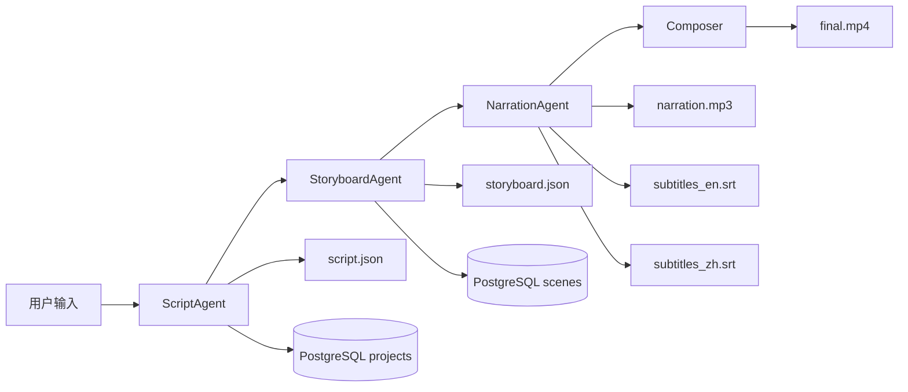

# StarVoyage AI Video Engine — 使用手册

> 版本：v0.1 | 对应阶段：第一、二阶段（CLI 工具）

---

## 目录

1. [环境准备](#1-环境准备)
2. [配置指南](#2-配置指南)
3. [CLI 命令参考](#3-cli-命令参考)
4. [Pipeline 工作流详解](#4-pipeline-工作流详解)
5. [主题模板（Niche）使用与自定义](#5-主题模板niche使用与自定义)
6. [常见使用场景](#6-常见使用场景)
7. [输出产物说明](#7-输出产物说明)
8. [与第三方项目的集成方式](#8-与第三方项目的集成方式)
9. [常见问题与排错](#9-常见问题与排错)

---

## 1. 环境准备

### 1.1 硬件要求

| 项目 | 最低要求 | 推荐 |
|------|---------|------|
| CPU | 4 核 | 8 核以上 |
| 内存 | 8 GB | 16 GB |
| 磁盘 | 10 GB 可用 | 50 GB（SSD）|
| 网络 | 宽带连接 | 低延迟访问 OpenRouter / SiliconFlow |

### 1.2 软件依赖

```
Python       ≥ 3.12       运行环境
FFmpeg       ≥ 5.0        视频合成（需在 PATH 中可用）
PostgreSQL   ≥ 15 + pgvector  项目存储 + 向量检索
Redis        ≥ 7          任务队列 / 缓存
```

**检查 FFmpeg：**

```bash
ffmpeg -version
# 如果未安装：
#   Windows: choco install ffmpeg  或 scoop install ffmpeg
#   macOS:   brew install ffmpeg
#   Linux:   apt install ffmpeg
```

### 1.3 数据库初始化

```bash
# 创建数据库
psql -U postgres -c "CREATE DATABASE starvoyage;"

# 启用 pgvector 扩展
psql -U postgres -d starvoyage -c "CREATE EXTENSION vector;"

# 验证扩展安装
psql -U postgres -d starvoyage -c "SELECT extname, extversion FROM pg_extension;"
# 应看到: vector  | 0.8.0  (或更高)
```

### 1.4 Python 环境安装

```bash
# 推荐使用虚拟环境
python -m venv venv
source venv/bin/activate   # Linux/macOS
# 或: venv\Scripts\activate  # Windows

# 安装核心依赖
pip install -r requirements.txt

# ── 安装第三方项目（二选一） ──

# 方式 A：安装到全局 site-packages（pip 标准方式）
pip install git+https://github.com/RayVentura/ShortGPT.git
pip install git+https://github.com/calesthio/OpenMontage.git

# 方式 B：克隆到项目 vendor/ 目录（推荐，见第 8 章详解）
#     scripts\setup-vendor.bat    # Windows
#     bash scripts/setup-vendor.sh # Linux/macOS

# 验证安装
python -c "import edge_tts; print('edge-tts OK')"
python -c "import psycopg2; print('psycopg2 OK')"
python -c "import redis; print('redis OK')"
```

### 1.5 API 密钥申请

| 服务 | 用途 | 申请地址 | 所需模型 |
|------|------|---------|---------|
| **OpenRouter** | LLM 调用（脚本/分镜）| https://openrouter.ai/keys | `deepseek/deepseek-chat-v3-0324` |
| **SiliconFlow** | 视频/图像生成 | https://cloud.siliconflow.cn | `Wan-AI/Wan2.2-T2V-A14B`、`black-forest-labs/FLUX.1-dev` |

---

## 2. 配置指南

所有配置集中在项目根目录的 [`config.yaml`](config.yaml) 中，敏感字段支持环境变量覆盖。

### 2.1 配置文件结构

```yaml
# ── 数据库 ──
postgres:
  host: 127.0.0.1          # PostgreSQL 主机
  port: 5432                # 端口
  database: starvoyage      # 数据库名
  user: postgres            # 用户名
  password: "ABC123###"     # 密码
  min_conn: 2               # 连接池最小连接数
  max_conn: 10              # 连接池最大连接数

redis:
  host: 127.0.0.1           # Redis 主机
  port: 6379                # 端口
  db: 0                     # 数据库编号
  password: "ABC123###"     # 密码

# ── LLM API ──
openrouter:
  api_key: ""               # OpenRouter API Key（或设环境变量 OPENROUTER_API_KEY）
  script_model: "deepseek/deepseek-chat-v3-0324"   # 脚本生成模型
  storyboard_model: "deepseek/deepseek-chat-v3-0324" # 分镜规划模型
  max_tokens: 8192
  temperature: 0.7

# ── 视频/图像生成 ──
siliconflow:
  api_key: ""               # SiliconFlow API Key（或设环境变量 SILICONFLOW_API_KEY）
  video_model: "Wan-AI/Wan2.2-T2V-A14B"
  image_model: "black-forest-labs/FLUX.1-dev"
  image_size: "1280x720"
  num_frames: 120           # 5秒 @ 24fps

# ── 配音 ──
edge_tts:
  voice: "en-US-AndrewNeural"   # 配音音色
  rate: "-5%"                    # 语速（负值=慢）
  volume: "+10%"                 # 音量增益

# ── 路径 ──
paths:
  output_dir: output             # 输出目录
  music_dir: assets/music        # 背景音乐库
  fonts_dir: assets/fonts        # 字体目录
  watermark_dir: assets/watermark # 水印目录
  template_dir: src/templates    # 模板目录

# ── 流水线参数 ──
log_level: INFO                  # 日志级别
max_scenes: 12                   # 最大场景数
default_scene_duration: 15       # 每场景默认时长（秒）
```

### 2.2 环境变量覆盖机制

环境变量的优先级高于 `config.yaml` 中的值：

| 环境变量 | 覆盖配置项 |
|---------|-----------|
| `OPENROUTER_API_KEY` | `openrouter.api_key` |
| `SILICONFLOW_API_KEY` | `siliconflow.api_key` |
| `STARVOYAGE_CONFIG` | 指定自定义配置文件路径 |

```bash
# 示例：通过环境变量注入 API Key
export OPENROUTER_API_KEY="sk-or-v1-xxxxxxxxxxxx"
export SILICONFLOW_API_KEY="sf-yyyyyyyyyyyyyy"
python -m src run --topic "成都火锅" --niche china_food
```

### 2.3 多配置切换

```bash
# 使用不同的配置文件（如测试环境）
python -m src --config /path/to/staging-config.yaml run --topic "..." 

# 或通过环境变量
export STARVOYAGE_CONFIG=/path/to/staging-config.yaml
python -m src run --topic "..."
```

---

## 3. CLI 命令参考

所有命令入口：

```bash
# 方式一（推荐）
python -m src <command> [options]

# 方式二
python main.py <command> [options]
```

### 3.1 全局选项

| 选项 | 说明 |
|------|------|
| `--config PATH` | 指定配置文件路径 |
| `--log-level {DEBUG,INFO,WARNING,ERROR}` | 覆盖日志级别 |
| `--no-db` | 跳过数据库连接（离线模式） |
| `-h, --help` | 查看帮助 |

### 3.2 `run` — 运行完整流水线

**用途：** 从主题输入到成片输出的全流程执行。

```bash
python -m src run \
  --topic <主题> \
  [--niche <模板名>] \
  [--duration <秒数>] \
  [--format youtube|shorts] \
  [--output-dir <路径>] \
  [--bg-music <路径>] \
  [--skip-video]
```

| 选项 | 类型 | 默认值 | 说明 |
|------|------|--------|------|
| `--topic` | **必填** | — | 视频主题（中文），如"成都火锅的百年历史" |
| `--niche` | 可选 | `general` | 内容主题模板，参见 `list-niches` |
| `--duration` | 可选 | `180` | 目标视频时长（秒），youtube 格式推荐 180-600，shorts 推荐 15-60 |
| `--format` | 可选 | `youtube` | 视频格式，`youtube`=横屏 16:9，`shorts`=竖屏 9:16 |
| `--output-dir` | 可选 | config 中配置 | 自定义输出目录 |
| `--bg-music` | 可选 | 无 | 背景音乐文件路径（mp3/wav） |
| `--skip-video` | 可选 | `false` | 跳过视频合成（只生成脚本+配音+字幕） |

**执行流程：**

```
run 命令执行时依次经历以下阶段：

Stage 1: Script Generation
  └─ 调用 LLM 生成脚本 JSON → 保存到 script.json
  └─ 写入 PostgreSQL projects 表

Stage 2: Storyboard Planning
  └─ 对每个场景扩展视觉描述 → 保存到 storyboard.json
  └─ 写入 PostgreSQL scenes 表

Stage 3: Narration + Subtitles (Phase 2)
  └─ Edge TTS 生成英文配音 → narration.mp3
  └─ 生成中英双语 SRT 字幕文件

Stage 4: Video Composition
  └─ 拼接视频片段 → 混音（配音 + 背景音乐）→ 烧录字幕
  └─ 质量检测（分辨率/帧率/码率）
  └─ 输出 final.mp4
```

**示例：**

```bash
# 3 分钟美食纪录片
python -m src run \
  --topic "成都火锅的百年历史" \
  --niche china_food \
  --duration 180

# 60 秒城市 Shorts
python -m src run \
  --topic "上海外滩的清晨" \
  --niche china_city \
  --duration 60 \
  --format shorts

# 带背景音乐的科技主题
python -m src run \
  --topic "深圳华强北电子市场" \
  --niche china_tech \
  --duration 300 \
  --bg-music assets/music/tech_background.mp3

# 只生成素材不合成视频（适合先审脚本）
python -m src run \
  --topic "西安古城墙的日落" \
  --niche travel \
  --duration 120 \
  --skip-video
```

**输出示意：**

```
  ── Stage 1: Script generation ──
  ScriptAgent: generating script for topic='成都火锅的百年历史' (180s, 12 scenes)
  ScriptAgent: script generated — title='The Century‑Old Charm of Chengdu Hotpot' (8 scenes)
  
  ── Stage 2: Storyboard generation ──
  StoryboardAgent: storyboard complete — 8 scenes enriched.
  
  ── Stage 3: Narration & subtitles ──
  TTS: generating → narration.mp3 (voice=en-US-AndrewNeural)
  Subtitles generated: EN ZH
  
  ── Stage 4: Video composition ──
  Composer: running FFmpeg …
  Composer: final video → output/20260622_143000_final.mp4
  
  ✅ Pipeline completed!
  📁 Output: output/20260622_143000_成都火锅的百年历史
  🎬 Video:  output/20260622_143000_成都火锅的百年历史/final.mp4
  🔊 Audio:  output/20260622_143000_成都火锅的百年历史/audio/narration.mp3
  📐 Quality: 1280×720 @ 24.0fps, 185.2s
  📝 Script: "The Century‑Old Charm of Chengdu Hotpot" (8 scenes)
```

### 3.3 `draft` — 草稿模式（仅脚本+分镜）

**用途：** 只生成脚本和分镜，不生成配音和视频，用于人工审核脚本内容。

```bash
python -m src draft \
  --topic <主题> \
  [--niche <模板名>] \
  [--duration <秒数>]
```

| 选项 | 类型 | 默认值 | 说明 |
|------|------|--------|------|
| `--topic` | **必填** | — | 视频主题 |
| `--niche` | 可选 | `general` | 主题模板 |
| `--duration` | 可选 | `180` | 目标时长 |

**示例：**

```bash
python -m src draft \
  --topic "广州早茶的仪式感" \
  --niche china_food \
  --duration 120
```

**输出：**

```
  📝 Draft ready!
  📁 Output: output/draft_20260622_120000_广州早茶的仪式感
  📝 Script: "The Ritual of Guangzhou Morning Tea" (6 scenes)
     → output/draft_20260622_120000_广州早茶的仪式感/script.json
     → output/draft_20260622_120000_广州早茶的仪式感/storyboard.json
```

> **工作流建议：** 先用 `draft` 生成草稿 → 人工审核 `script.json` → 确认后运行 `run --skip-video` 生成配音和字幕 → 最后准备视频素材运行完整 `run`

### 3.4 `init-db` — 初始化数据库

**用途：** 创建数据库表结构、pgvector 扩展和索引。

```bash
python -m src init-db
# => ✅ Database schema initialised.
```

**创建的数据库表：**

| 表名 | 用途 |
|------|------|
| `projects` | 项目记录（主题、niche、状态、脚本 JSON 等） |
| `scenes` | 分镜场景（含 pgvector embedding 列，支持向量搜索） |
| `tasks` | 后台任务日志 |

> 该命令是幂等的——重复执行不会产生副作用（使用 `CREATE TABLE IF NOT EXISTS`）。

### 3.5 `list-projects` — 查看历史项目

**用途：** 查看所有已执行项目的列表。

```bash
python -m src list-projects [--limit N] [--json]
```

| 选项 | 类型 | 默认值 | 说明 |
|------|------|--------|------|
| `--limit` | 可选 | `10` | 返回最近 N 条记录 |
| `--json` | 可选 | `false` | JSON 格式输出（便于程序解析） |

**输出示意：**

```
  📋 Recent projects (3):

    ID  Status          Topic                                          Created
   ────  ──────────────  ────────────────────────────────────────  ────────────────────
     3  completed       成都火锅的百年历史                           2026-06-22 14:30:00
     2  draft_ready     上海外滩的清晨                               2026-06-22 10:00:00
     1  failed          深圳华强北电子市场                            2026-06-21 18:00:00
```

### 3.6 `project-info` — 查看项目详情

**用途：** 查看单个项目的完整信息。

```bash
python -m src project-info <project_id> [--json]
```

**输出示意：**

```
  Project #3
  Topic:    成都火锅的百年历史
  Niche:    china_food
  Duration: 180s
  Format:   youtube
  Status:   completed
  Created:  2026-06-22 14:30:00+08:00
  Output:   output/20260622_143000_成都火锅的百年历史/final.mp4
```

### 3.7 `check-quality` — 视频质量检测

**用途：** 对已生成的视频文件进行质量检测（不依赖数据库）。

```bash
python -m src check-quality <video_file_path>
```

**检测指标：**

| 指标 | 说明 |
|------|------|
| Resolution | 视频分辨率（宽×高） |
| FPS | 帧率 |
| Duration | 视频时长 |
| Video Codec | 视频编码格式 |
| Audio Codec | 音频编码格式 |
| Bitrate | 总比特率 |
| File Size | 文件大小 |

**输出示意：**

```
  📐 Quality Report:
  Resolution: 1280×720
  FPS:        24.00
  Duration:   185.2s
  Video:      h264
  Audio:      aac
  Bitrate:    1,234,567 bps
  File size:  28,456,789 bytes
```

### 3.8 `list-niches` — 查看可用主题模板

**用途：** 列出所有可用的内容主题模板及其描述。

```bash
python -m src list-niches
```

**输出示意：**

```
  Available niches (4):

  • china_city           — 中国城市风貌与人文生活
  • china_food           — 中国街头美食与餐饮文化
  • china_tech           — 中国科技与制造业创新
  • travel               — 中国旅游目的地与自然风光
```

---

## 4. Pipeline 工作流详解

### 4.1 完整执行流



### 4.2 各阶段产出物

| 阶段 | 产物 | 格式 | 说明 |
|------|------|------|------|
| Script | `script.json` | JSON | 标题、描述、场景列表（中英解说+视觉提示） |
| Storyboard | `storyboard.json` | JSON | 扩展视觉描述、镜头运动、光线、关键元素 |
| Narration | `narration.mp3` | MP3 | 英文旁白配音（Edge TTS） |
| Subtitles | `subtitles_en.srt` | SRT | 英文字幕文件 |
| Subtitles | `subtitles_zh.srt` | SRT | 中文字幕文件 |
| Composition | `final.mp4` | MP4 | 最终成片（含配音+字幕+背景音乐） |

### 4.3 `script.json` 结构示例

```json
{
  "title": "The Century-Old Charm of Chengdu Hotpot",
  "description": "Explore the rich history and culture behind Chengdu's famous hotpot...",
  "scenes": [
    {
      "id": 1,
      "duration": 20,
      "zh_narration": "在成都的街头巷尾，火锅的香气无处不在……",
      "en_narration": "In the streets and alleys of Chengdu, the aroma of hotpot is everywhere...",
      "visual_prompt": "cinematic shot of a steaming hotpot at a traditional Chengdu restaurant, golden hour, steam rising",
      "shot_type": "wide"
    }
  ]
}
```

### 4.4 `storyboard.json` 结构示例

```json
[
  {
    "id": 1,
    "duration": 20,
    "zh_narration": "在成都的街头巷尾，火锅的香气无处不在……",
    "en_narration": "In the streets and alleys of Chengdu...",
    "shot_type": "wide",
    "expanded_visual_prompt": "A wide cinematic shot of a traditional Chengdu hotpot restaurant at golden hour, steam rising from a bubbling bronze pot, warm amber lighting, patrons visible in the background, shallow depth of field focusing on the pot",
    "camera_movement": "slow dolly in",
    "lighting": "golden hour warm, amber tones",
    "key_elements": ["steaming hotpot", "traditional interior", "copper pot", "chopsticks"]
  }
]
```

### 4.5 错误处理与重试

如果流水线在某阶段失败：

1. **数据库记录**：`projects` 表的 `status` 会被标记为 `failed`，`error_message` 记录错误信息
2. **部分产物**：失败之前的产物会保留在输出目录中
3. **重试策略**：修正问题后重新执行 `run`，会创建新的项目记录

常见错误：

| 错误 | 原因 | 解决 |
|------|------|------|
| `OpenRouter API error 401` | API Key 未配置或无效 | 检查 `config.yaml` 或 `OPENROUTER_API_KEY` |
| `OpenRouter API error 429` | 速率限制 | 降低请求频率，检查账户余额 |
| `SiliconFlow ... error` | API Key 或模型名称问题 | 检查 `config.yaml` 或 `SILICONFLOW_API_KEY` |
| `FFmpeg failed` | FFmpeg 未安装或参数问题 | 确认 `ffmpeg -version` 可用 |
| `TTS generation failed` | edge-tts 网络问题 | 检查网络连接 |

---

## 5. 主题模板（Niche）使用与自定义

### 5.1 内置模板一览

| 模板名 | 适用内容 | LLM tone | 推荐配音 |
|--------|---------|----------|---------|
| `china_food` | 中国街头美食与餐饮文化 | warm, authentic, curious | AndrewNeural（男声） |
| `china_city` | 中国城市风貌与人文 | awe-inspiring, poetic, reflective | JennyNeural（女声） |
| `china_tech` | 科技与制造业创新 | impressive, forward-looking, precise | GuyNeural（男声） |
| `travel` | 旅游目的地与自然风光 | adventurous, serene, immersive | MichelleNeural（女声） |

### 5.2 模板工作原理

模板通过 YAML 文件控制三个层面的行为：

**脚本层（`script`）：**
- `tone` — 影响 LLM 的行文风格指令
- `forbidden_words` — LLM 输出中禁止出现的词汇
- `preferred_words` — LLM 输出中鼓励使用的词汇

**视觉层（`visuals`）：**
- `style` — 画面风格描述
- `shot_types` — 推荐的镜头类型
- `color_mood` — 色彩氛围
- `avoid` — 应避免的画面元素

**配音层（`narration`）：**
- `voice` — Edge TTS 音色
- `pace` — 语速

### 5.3 自定义模板

在 `src/templates/niches/` 目录下新建 YAML 文件即可：

```yaml
# src/templates/niches/china_art.yaml
name: china_art
description: 中国传统艺术与手工艺

script:
  tone: "elegant, respectful, insightful"
  structure: "hook → history → technique → master → legacy"
  forbidden_words: ["cheap", "mass-produced", "souvenir"]
  preferred_words: ["masterful", "intricate", "heritage", "artisan"]

visuals:
  style: "elegant, soft lighting, macro details, artisan hands at work"
  shot_types: ["close-up hands", "wide workshop", "medium artisan", "detail macro"]
  color_mood: "warm amber, natural wood tones, soft neutral backgrounds"
  avoid: ["modern factories", "assembly lines", "generic mass production"]

narration:
  voice: "en-US-JennyNeural"
  pace: "slow, deliberate, 120 wpm"
  energy: "calm and reverent"

music:
  mood: "traditional, serene, contemplative"
  energy: "low"
  genre: "traditional Chinese instruments, guzheng, erhu"

subtitle:
  en_style: "white, bottom center, FontSize=18"
  zh_style: "yellow, above EN sub, FontSize=14"
```

创建后即可使用：

```bash
python -m src list-niches
# 会显示新增的 china_art

python -m src run --topic "景德镇青花瓷" --niche china_art --duration 180
```

### 5.4 LLM Prompt 模板自定义

Prompt 模板位于 `src/templates/prompts/`：

- `script_zh.txt` — 脚本生成的 System Prompt（控制 LLM 角色和输出规范）
- `storyboard.txt` — 分镜规划的 System Prompt

可按需编辑这些文件来调整 LLM 的行为风格，无需修改代码。

---

## 6. 常见使用场景

### 场景 1：标准工作流（推荐）

```bash
# 第1步：草稿审核
python -m src draft --topic "重庆小面的前世今生" --niche china_food --duration 180

# 审核 output/draft_xxx/script.json 内容

# 第2步：生成全部素材但不合成视频
python -m src run --topic "重庆小面的前世今生" --niche china_food --duration 180 --skip-video

# 第3步：准备视频片段后最终合成
# （准备 mp4 片段放入输出目录，然后再调用合成）
```

### 场景 2：批量生成 Shorts

```bash
for topic in \
  "成都担担面" \
  "西安肉夹馍" \
  "兰州牛肉面" \
  "北京烤鸭"; do
  python -m src draft \
    --topic "$topic的街头美食故事" \
    --niche china_food \
    --duration 60
done
```

### 场景 3：不同主题风格对比

```bash
# 同一城市，不同视角
python -m src draft --topic "重庆洪崖洞夜景" --niche china_city --duration 120
python -m src draft --topic "重庆洪崖洞夜景" --niche travel --duration 120
# 对比两个输出，选择更合适的风格
```

### 场景 4：断网离线模式

```bash
# 不使用数据库，所有输出写到本地文件
python -m src --no-db run --topic "苏州园林的四季" --niche travel --duration 300
```

### 场景 5：Python 代码中调用

```python
from src.config.settings import load_config
from src.pipeline.orchestrator import PipelineOrchestrator

cfg = load_config()
orch = PipelineOrchestrator(cfg)

# 草稿模式
result = orch.draft(
    topic="云南大理的洱海日出",
    niche="travel",
    duration=60,
)
print(f"Script: {result['script']['title']}")
print(f"Scenes: {len(result['storyboard'])}")

# 完整流水线
result = orch.run(
    topic="云南大理的洱海日出",
    niche="travel",
    duration=60,
    fmt="shorts",
    skip_video=True,  # 跳过视频合成
)
```

---

## 7. 输出产物说明

### 7.1 目录结构

每次运行会创建一个带时间戳的子目录：

```
output/
├── 20260622_143000_成都火锅的百年历史/
│   ├── script.json              # 脚本（Scene 1: 脚本生成）
│   ├── storyboard.json          # 分镜（Scene 2: 分镜规划）
│   ├── audio/
│   │   └── narration.mp3        # 配音（Scene 3: TTS）
│   ├── subtitles/
│   │   ├── subtitles_en.srt     # 英文字幕
│   │   └── subtitles_zh.srt     # 中文字幕
│   └── final.mp4                # 成片（Scene 4: 合成）
│
└── draft_20260622_120000_广州早茶/
    ├── script.json
    └── storyboard.json
```

### 7.2 字幕样式说明

生成的视频中字幕样式：

```
                            ← 中文字幕（黄色，14pt）
                   Hello, welcome to...  ← 英文字幕（白色，18pt）
┌──────────────────────────────────────────────────┐
│                                                  │
│                   （视频画面）                      │
│                                                  │
│                                                  │
│                                                  │
│                   Hello, welcome to...           │
│                   欢迎来到...                      │
└──────────────────────────────────────────────────┘
```

### 7.3 质量标准

`check-quality` 的参考标准：

| 指标 | YouTube 长视频 | Shorts |
|------|---------------|--------|
| 分辨率 | 1920×1080 或 1280×720 | 1080×1920 或 720×1280 |
| 帧率 | 24fps 或 30fps | 24fps 或 30fps |
| 视频编码 | H.264 | H.264 |
| 音频编码 | AAC, 192kbps+ | AAC, 128kbps+ |
| 目标时长 | 180-600s | 15-60s |

---

## 8. 与第三方项目的集成方式

本系统对第三方项目采用 **依赖调用** 而非源码嵌入的方式。

### 8.0 两种引入方式

ShortGPT 与 OpenMontage 支持两种引入方式，任选其一：

---

#### 方式 A：pip 安装到全局 site-packages（标准方式）

```bash
pip install git+https://github.com/RayVentura/ShortGPT.git
pip install git+https://github.com/calesthio/OpenMontage.git
```

**优点：** 一行命令，pip 自动处理依赖。  
**缺点：** 包安装在 Python 全局目录（`site-packages`）中，项目目录内看不到源码。

---

#### 方式 B：Vendoring — 克隆到项目 vendor/ 目录（推荐）

将第三方仓库直接克隆到项目的 `vendor/` 目录，`src/__init__.py` 会自动将其加入 Python 模块搜索路径，使 `import ShortGPT` 等语句直接从本地目录加载。

##### 执行步骤

```bash
# Windows
scripts\setup-vendor.bat

# Linux / macOS / Git Bash
bash scripts/setup-vendor.sh
```

脚本会依次：
1. 克隆 ShortGPT 到 `vendor/ShortGPT/`
2. 克隆 OpenMontage 到 `vendor/OpenMontage/`
3. 安装它们各自的 Python 依赖（`pip install -r requirements.txt`）

##### 自动加载原理

`src/__init__.py` 中做了如下操作：

```python
# src/__init__.py（简化）
_VENDOR_DIR = Path(__file__).resolve().parent.parent / "vendor"
if _VENDOR_DIR.is_dir():
    for _p in sorted(_VENDOR_DIR.iterdir()):
        if _p.is_dir() and not _p.name.startswith("."):
            sys.path.insert(0, str(_p.resolve()))
```

因此 `vendor/ShortGPT/` 和 `vendor/OpenMontage/` 下的所有 Python 包都可以直接导入。

##### 验证是否生效

```bash
# 尝试直接从 vendor 导入
python -c "import sys; print([p for p in sys.path if 'vendor' in p])"
# 应输出 vendor 目录路径

python -c "import shortGPT; print('ShortGPT imported from', shortGPT.__file__)"
python -c "import openmontage; print('OpenMontage imported from', openmontage.__file__)" 2>/dev/null || \
python -c "import OpenMontage; print('OpenMontage OK')" 2>/dev/null || \
echo "OpenMontage 模块名请以实际为准"
```

##### 更新 vendor 依赖

```bash
# 重新运行 setup 脚本即可 git pull 更新
scripts\setup-vendor.bat
```

##### 版本管理说明

`vendor/.gitignore` 中忽略了 `ShortGPT/` 和 `OpenMontage/` 目录，**不会**将它们提交到主项目的 git 仓库中。每个开发者各自运行 `setup-vendor` 来获取。如果团队需要锁定版本，可以将 `vendor/.gitignore` 中的对应行注释掉，改为使用 git submodule 管理。

---

### 8.1 [ShortGPT](https://github.com/RayVentura/ShortGPT)

```bash
pip install git+https://github.com/RayVentura/ShortGPT.git
```

本系统当前阶段未强制依赖 ShortGPT —— 其字幕、配音和剪辑工具集在后续阶段可作为 `NarrationAgent` 和 `Composer` 的增强替换。目前在代码中通过以下方式集成：

```python
# 示例：在 NarrationAgent 中使用 ShortGPT 的字幕生成
# (目前使用内置 SRT 生成，后续可切换至 ShortGPT)
from ShortGPT.utils.subtitle_utils import generate_subtitles
```

### 8.2 [OpenMontage](https://github.com/calesthio/OpenMontage)

```bash
pip install git+https://github.com/calesthio/OpenMontage.git
```

OpenMontage 提供 Agent 编排框架，在后续阶段可用于：

- 替换 `PipelineOrchestrator` 的自定义编排
- 使用其内置的 12 条生产流水线模板
- 多 Agent 并行调度（如并行生成多场景视频）

### 8.3 [edge-tts](https://github.com/rany2/edge-tts)

```bash
pip install edge-tts
```

**已集成到 `TTSClient`**（`src/models/tts.py`），所有配音调用均通过 edge-tts 完成。

### 8.4 FFmpeg

非 Python 包，作为系统命令调用。**已集成到 `Composer`**（`src/pipeline/composer.py`）：

| 功能 | FFmpeg 命令 |
|------|-------------|
| 视频拼接 | `ffmpeg -f concat ...` |
| 音频混音 | `amix=inputs=2:duration=first` |
| 字幕烧录 | `subtitles=...:force_style=...` |
| 质量检测 | `ffprobe -show_format -show_streams ...` |

---

## 9. 常见问题与排错

### Q1: `ModuleNotFoundError: No module named 'yaml'`

```bash
# 未安装依赖
pip install -r requirements.txt
```

### Q2: `psycopg2.OperationalError: connection to server ... failed`

```
原因：PostgreSQL 未运行或连接信息不正确
解决：
  1. 确认 PostgreSQL 服务运行中
  2. 检查 config.yaml 中的 postgres 配置
  3. 确认数据库 starvoyage 已创建：
     psql -U postgres -c "SELECT 1 FROM pg_database WHERE datname='starvoyage'"
```

### Q3: `redis.exceptions.ConnectionError`

```
原因：Redis 未运行
解决：
  # Windows: 启动 Redis 服务
  redis-server
  
  # 或检查 config.yaml 中的 redis 配置
```

### Q4: OpenRouter API 返回 402 Payment Required

```
原因：账户余额不足
解决：https://openrouter.ai/activity 充值
```

### Q5: SiliconFlow 视频生成超时

```
原因：视频生成队列较长
解决：
  - 增加 POLL_INTERVAL / MAX_POLL_TIME（src/models/video.py）
  - 或减少 num_frames（config.yaml 中配置）
```

### Q6: FFmpeg 找不到输入文件

```
原因：路径中有空格或特殊字符
解决：确保文件路径不加引号，或使用 --output-dir 指定无空格的路径
```

### Q7: UnicodeEncodeError 在 Windows 终端

```
原因：Windows 控制台编码问题
解决：
  set PYTHONIOENCODING=utf-8
  python -m src list-niches
```

### Q8: 如何清除所有数据？

```bash
# 清空数据库
psql -U postgres -d starvoyage -c "DROP SCHEMA public CASCADE; CREATE SCHEMA public;"
python -m src init-db

# 清空输出文件
rm -rf output/*
```
